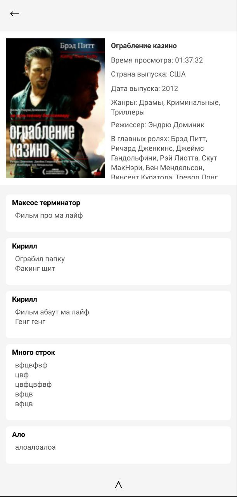

## Твой путеводитель по кинематографу

Мой проект это удобное и стильное приложение для Android, которое позволяет вам делиться своим мнением о любимых (и не очень) фильмах. Создавайте детальные рецензии, оставляйте комментарии и участвуйте в обсуждениях с другими киноманами.

Сейча проект находится на стадии alpha!!!

Основные возможности:

• Обзор фильмов: Просматривайте детальную информацию о фильмах, актеров, режиссеров, отзывы и многое другое.
• Рецензии: Пишите свои собственные рецензии, делитесь впечатлениями о фильмах, оставляйте рейтинги и добавляйте фотографии.
• Обсуждение: Читайте и оставляйте комментарии к рецензиям других пользователей.

Преимущества:

• Интуитивный интерфейс: Приложение разработано с учетом удобства пользователя, имеет простой и интуитивный интерфейс.
• Бесплатно: Приложение доступно бесплатно, без скрытых платежей или подписок.
• Социальная составляющая: Общайтесь с другими киноманами, делитесь своим мнением и узнавайте о новых фильмах.

[Ссылка на ТГК](https://t.me/W1nkkkkIT)

